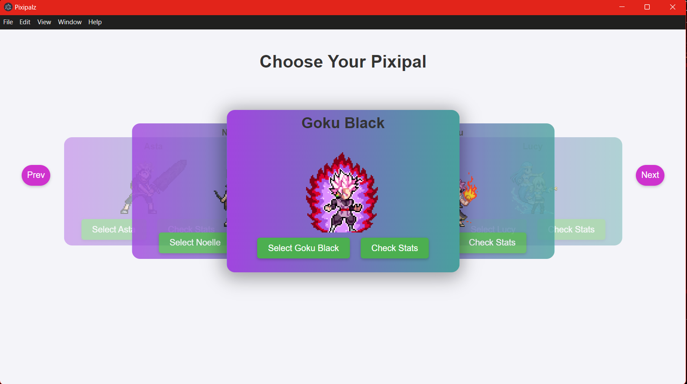
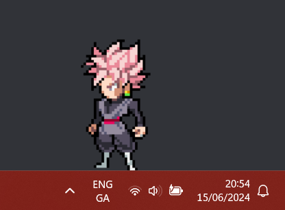

# Pixipalz

Welcome to Pixipalz, the desktop pet app that brings a charming virtual companion to your workspace! Whether you're coding, designing, or just surfing the web, Pixipalz provides a delightful distraction that keeps you company and adds a touch of fun to your desktop.



# Description

Pixipalz allows you to select from a variety of adorable characters that live on your desktop. These pets can perform various animations and interact with you while you perform other tasks on your computer. It's designed to bring a little joy and companionship to your day without getting in the way of your productivity.



# Features

- **Choose Your Pet**: Select from a range of characters with unique appearances and personalities.
- **Interactivity**: Your desktop pet can respond to your clicks and interactions.

# Technology Stack

Pixipalz is built using a combination of modern technologies, frameworks, and languages that together create a robust and interactive desktop companion application. Below is a detailed overview of our stack:

## Core Technologies

### Electron
- **Version**: 31.0.0
- **Usage**: Electron serves as the core framework, allowing Pixipalz to run as a native desktop application across multiple platforms. It facilitates the creation of native windows and access to system resources.

## Frontend Technologies

### HTML, CSS, JavaScript
- **Usage**: These core web technologies are used to structure, style, and program the behavior of the Pixipalz user interface, ensuring a rich interactive experience.

## Backend Technologies

### Node.js
- **Usage**: Provides the runtime environment for Electron and is used for handling back-end operations such as file system interactions and window management.

## Database

### IndexedDB
- **Usage**: A client-side web database used within Electron to store non-relational data locally, enhancing performance and ensuring data persistence.

## Additional Libraries

### image-size
- **Version**: 1.1.1
- **Usage**: This Node.js module is used to calculate the dimensions of images, crucial for processing and displaying pet images correctly within the application.

## Development Tools

### IPC (Inter-Process Communication)
- **Usage**: Electron's IPC is used for asynchronous communication between the renderer process and the main process, facilitating a responsive user interface by offloading operations that do not require immediate feedback from the user.

## User Interface

### BrowserWindow
- **Usage**: A class in Electron used to create and manage application windows. It is essential for rendering the HTML and JavaScript of the Pixipalz UI.

### Menu, MenuItem
- **Usage**: These components from Electron are used to create custom native menus that are integrated into the application's interface, enhancing navigation and usability.

## File System

### Node.js fs (File System) module
- **Promise API**: Utilized for handling all file operations asynchronously, which helps in managing configuration files, user data, and application logs efficiently.

## Icons and Graphics

### Assets
- **Usage**: Contains icons and images used throughout the application, ensuring a visually appealing and consistent branding across all platforms.

This technology stack helps in delivering a seamless and engaging user experience, making Pixipalz an enjoyable desktop companion.

# Installation

### Prerequisites
Before installing Pixipalz, make sure you have the following software installed on your computer:

- [Node.js](https://nodejs.org/en/download/) (which includes npm)
- [Git](https://git-scm.com/) for cloning the repository

### Cloning the Repository
To get started, clone the repository to your local machine by running:

```bash
git clone https://github.com/your-username/pixipalz.git
cd pixipalz
```

### Installing Dependencies
Install all the necessary dependencies by executing:

```bash
npm install
```

### Running the Application
To run the application locally, use the following command:

```bash
npm run start
```


# Credits

Pixipalz uses assets and resources provided by the following creators and websites. I sincerely thank them for their contributions and encourage you to support them:

- **[viniciusonico]**: Asta Sprite Sheet (https://www.deviantart.com/viniciusonico/art/Asta-Base-Form-838932309)
- **[MichelSTGamer's]**: Noelle Silva Sprite sheet (https://www.deviantart.com/michelstgamer/art/Noelle-Silva-JUS-Sprite-sheet-855284969)
- **[QUE]**: Goku Black Sprite sheet (https://www.spriters-resource.com/custom_edited/dragonballcustoms/sheet/86342/)
- **[Angryboy]**: Goku Black Sprite sheet (https://www.spriters-resource.com/custom_edited/dragonballcustoms/sheet/86342/)
- **[Luka]**: Goku Black Sprite sheet (https://www.spriters-resource.com/custom_edited/dragonballcustoms/sheet/86342/)
- **[ExtremeButouden]**: Goku Black Sprite sheet (https://www.spriters-resource.com/custom_edited/dragonballcustoms/sheet/86342/)
- **[XElectromanX10]**: Shirou Emyia Sprite sheet (https://www.deviantart.com/xelectromanx10/art/Shirou-Emiya-JUS-Sprite-Sheet-929698074)
- **[XElectromanX10]**: Rin Tohsaka Sprite sheet (https://www.deviantart.com/xelectromanx10/art/Rin-Tohsaka-JUS-Sprite-Sheet-901827904)
- **[rasgar]**: Natsu Sprite sheet (https://www.spriters-resource.com/mobile/senransamuraikingdom/sheet/117194/)
- **[rasgar]**: Lucy Sprite sheet (https://www.spriters-resource.com/mobile/senransamuraikingdom/sheet/117195/)

Please visit their websites and profiles to view more of their work and possibly support them.